# GameBOX
## Code Institute Milestone Project 4 - Full Stack Frameworks with Django
A fully responsive full-stack e-commerce website selling video games and downloadable content with a focus on promotions.

 

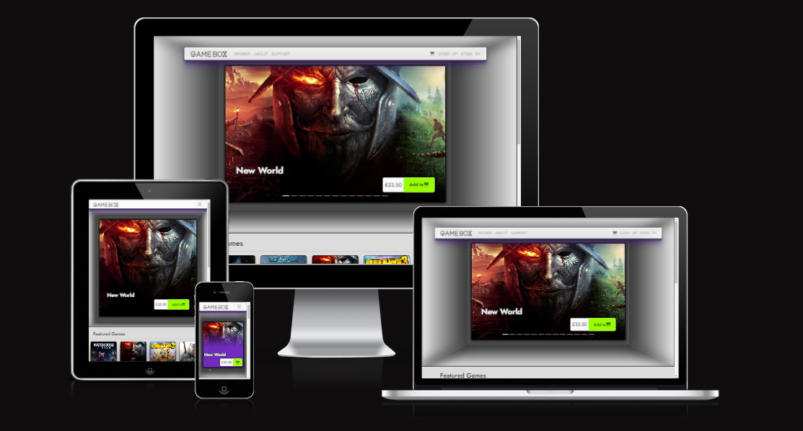

- [User Experience](#user-experience)
  * [Strategy](#strategy)
    + [Primary Goal](#primary-goal)
      - [Owner side:](#owner-side-)
      - [User side:](#user-side-)
  * [Structure](#structure)
    + [Front-End Structure](#front-end-structure)
      - [Base Template](#base-template)
      - [Home App](#home-app)
      - [Games App](#games-app)
      - [Promo App](#promo-app)
      - [Cart App](#cart-app)
      - [Checkout App](#checkout-app)
      - [Profiles App](#profiles-app)
      - [Used Media](#used-media)
    + [Back-End Structure](#back-end-structure)
      - [Physical Database Model](#physical-database-model)
      - [Forms](#forms)
      - [Amazon Web Services (AWS) S3 bucket](#amazon-web-services--aws--s3-bucket)
  * [Scope](#scope)
    + [Admin/Site Owner User Stories (A)](#admin-site-owner-user-stories--a-)
    + [Potential/New User User Stories (B)](#potential-new-user-user-stories--b-)
    + [Existing (Registered) User User Stories (C)](#existing--registered--user-user-stories--c-)
  * [Skeleton](#skeleton)
    + [Wireframes](#wireframes)
  * [Surface](#surface)
    + [Color Palette](#color-palette)
    + [Typography](#typography)
- [Features](#features)
  * [MVP Features](#mvp-features)
    + [Feature 0 - Authentication and AllAuth](#feature-0---authentication-and-allauth)
    + [Feature 0.33 - Navigation Bar](#feature-033---navigation-bar)
    + [Feature 0.66 - Footer](#feature-066---footer)
    + [Feature 1 - Carousel with 3D Box effect (Home Page)](#feature-1---carousel-with-3d-box-effect--home-page-)
    + [Feature 2 - Featured Games (Home Page)](#feature-2---featured-games--home-page-)
    + [Feature 3 - Deals of the Day (Home Page)](#feature-3---deals-of-the-day--home-page-)
    + [Feature 4 - Games Page (Browse)](#feature-4---games-page--browse-)
    + [Feature 5 - Game Page](#feature-5---game-page)
    + [Feature 6 - Game Attribute Page](#feature-6---game-attribute-page)
    + [Feature 7 - About Page](#feature-7---about-page)
    + [Feature 8 - Support Page](#feature-8---support-page)
    + [Feature 9 - Cart Page](#feature-9---cart-page)
    + [Feature 10 - Checkout Page](#feature-10---checkout-page)
    + [Feature 11 - Checkout Success Page](#feature-11---checkout-success-page)
    + [Feature 12 - Profile _Pages_](#feature-12---profile--pages-)
      - [Sub-feature - Profile/My Profile](#sub-feature---profile-my-profile)
      - [Sub-feature - Billing Address](#sub-feature---billing-address)
      - [Sub-feature - Styled AllAuth Templates](#sub-feature---styled-allauth-templates)
    + [Feature 13 - Media View Page and Media Forms (Staff Only)](#feature-13---media-view-page-and-media-forms--staff-only-)
    + [Feature 14 - Promo Page](#feature-14---promo-page)
    + [Feature 15 - Game/DLC Forms](#feature-15---game-dlc-forms)
- [Technologies](#technologies)
- [Testing](#testing)
  * [HTML Validation](#html-validation)
    + [Home App](#home-app-1)
    + [Games App](#games-app-1)
    + [Promo App](#promo-app-1)
    + [Cart App](#cart-app-1)
    + [Checkout App](#checkout-app-1)
    + [Profiles App](#profiles-app-1)
  * [CSS Validation](#css-validation)
  * [JavaScript Validation](#javascript-validation)
    + [Base](#base)
    + [Home App](#home-app-2)
    + [Games App](#games-app-2)
    + [Promo App](#promo-app-2)
    + [Cart App](#cart-app-2)
    + [Checkout App](#checkout-app-2)
  * [Python Validation](#python-validation)
    + [Home App](#home-app-3)
    + [Games App](#games-app-3)
    + [Promo App](#promo-app-3)
    + [Cart App](#cart-app-3)
    + [Checkout App](#checkout-app-3)
    + [Profiles App](#profiles-app-2)
  * [Accessibility](#accessibility)
  * [Performance Testing](#performance-testing)
  * [Unit and User Story Testing](#unit-and-user-story-testing)
- [Bug Log](#bug-log)
- [API Configuration](#api-configuration)
  * [Django Mail with Google Email](#django-mail-with-google-email)
  * [Stripe API](#stripe-api)
- [Deployment](#deployment)
  * [Amazon Web Services S3 Bucket](#amazon-web-services-s3-bucket)
  * [Local Deployment](#local-deployment)
- [Credits](#credits)
  * [Code Content](#code-content)
  * [Media Content](#media-content)
  * [Acknowledgements](#acknowledgements)

<small><i><a href='http://ecotrust-canada.github.io/markdown-toc/'>Table of contents generated with markdown-toc</a></i></small>

# User Experience

## Strategy

### Primary Goal

#### Owner side:

- To allow users to browse video games and video games downloadable content.
- To allow users to view designated promotions page.
- To encourage users to explore different video games.
- To allow users to register for an account.
- To provide users with a way to filter/sort the available content.

#### User side:

- To be able to create an account.
- To be able to change my account details.
- To be able to save my billing details.
- To be able to purchase video games and video game downloadable content.
- To be able to view details and information about the video game content.
- To be able to participate in promotions.

## Structure

### Front-End Structure

The website consists of 6 apps, containing 16 custom pages and 5 custom modals (excl. custom error pages, custom allauth/admin templates).

Design and content structure has been inspired by both [IGDB](https://www.igdb.com/) and [Good Old Games](https://www.gog.com).

#### Base Template

The base template is home to:
- Header
    * Navigation bar
    * Mobile navigation menu
        + The original bootstrap menu did not fit with the design of the website, so I repurposed one of the bootstrap offset elements instead, giving it the effect of a video game menu.
- Body
    * Messages/Toasts container
- Footer
    * Social links
    * Newsletter subscription form
        + This feature records any subscriptions on the specific user's profile, so at present it is only available to registered users.
    * Navigation links
        + Exactly like the links in the main navigation bar, but allows the user to move on to a different page should the wish once they have scrolled to the bottom of the page.

#### Home App

1. Landing Page - index.html
This is the first page the user sees when they visit the website.
- Carousel
    * This is the first thing the user sees when they enter and in combination with the art of the video game cover images, it becomes a very effective marketing tool.
    * The carousel and art is further complimented by a 3D box effect which was created using SVGs some CSS and a fair bit of math to allow it to fit perfectly to screens! Very fun idea to execute, but a bit on the time consuming side when it's your first time working with SVGs in more depth.
    * The buttons on the carousel do not feature an input field, so they have been set to add a default quantity of 1.
    * Each carousel item is it's own anchor link, so clicking on the image itself redirects the user to the game/dlc/promo they clicked on in a new tab.
    * Carousel has the ability to display both games/DLCs and promos.

- Featured Games
    * Featured images are shuffled at each page refresh as they are picked from a pool of games or DLCs picked by the business owner to be featured... in this feature.

- Deals of The Day
    * Features promotions (sale) which have designated pages, or game content which is in a promotion that does not have a landing page, organized chronologically.
    * Countdown shows exact time left on the sales.
        + These are currently set for around 40 days so the assessors don't need to set them up themselves, however the general idea would be to have promotions which have 1-2 days remaining.
    * Each card is a link to the respective game/DLC or promo.

2. View All Media - media_list.html
- This page is only available to staff members and can be accessed through the Admin button dropdown menu. It allows staff/owner to view any game content with assigned media, any unassigned media as well as make changes to the media.
    * <small>(Media includes game content cover image, landing (wide) image, and preview media, including video embedding)</small>

3. Media Add/Edit - media_crud.html
- Consists of a single form which is used for both adding and editing media objects.

4. About Us - about.html
- This is one of two static pages on the website. It shows the business' story, mission and story.

5. Support - support.html
 - Second static page in the website and it is used to display frequently asked question by using Bootstrap's carousel without any controls other than the pips, which I have turned into the clickable list of questions. Once the user clicks on one of the questions, the answer slides in in the space underneath.

#### Games App

1. Browse - index.html
- Page is used to display all available game and DLC content.
- As an include, this page features a games filter which allows users to filter the displayed content based on multiple criteria, such as features, tags, platforms, etc.
- The users are also able to sort their content by price, title (name), discount, etc.
- The content is paginated with 12 items being shown at any one time, however depending on the game-base this could easily be set to a higher number.
- The game cards are animated though a JavaScript event handler which adds the class `flip` on mouseover.

3. Game Detail - game.html

<small>This page's design is inspired by [IGDB](https://www.igdb.com/).</small>

- This page is used to display the individual game information.
- It provides the user with the release date, a short description, and the storyline to the game.
- This page features a rating system which allows users to vote on a game from 1-5 stars with the verbal rating being Awful, Bad, Average, Good and Very Good. Once the user votes the rating is added to the system asynchronously and updated on the screen for the user. If a user has previously voted the text content also changes from "How would you rate this game?" to "You have rated this game:".
- The second feature is the media carousel, which also allows for videos (which open in a separate modal) to be played in a separate modal. It is set to rotate automatically at an interval.
- The user is able to specify an amount and add the game(s) to the cart.
- The genre and platform section as the information panel include links which open in a new tab and redirect to one of two pages depending on the user's choice. (see point 5 of Games Attributes page)

4. Game Add/Edit - game_crud.html
- Consists of a single form which is used for both adding and editing any games or DLCs.

5. Game Attributes - game_attr.html
- This page is used to display video games associated with the specific platform/developer/publisher depending on what link the user has clicked in the Game Detail page.

#### Promo App

1. Promo Page - index.html
- This page is used to view games which are included in the specific promotion.
- The page features a carousel which displays 4 games at a time, as well as a table with pagination which also allows quick sorting.

There is an additional template which is used to apply the same functionality for Add/Edit in Django Admin.

#### Cart App

1. Cart - index.html
- This page has three separate states:
    * If there are no items in the cart, the page displays a picture of the video game character from the video game Portal and a speech bubble expressing dissatisfaction of the empty cart in a typical GLaDOS manner. 
        + As not everybody is going to be aware of the character or it's wittiness it was important to ensure that the user does misconstrue the message, I have added a small paragraph underneath which clarifies things and encourages the user to keep exploring the site.
    * If there are items in the cart, they are shown in a table with quantity and price, and allows the user to either visit the page of the games they have in their bag or to remove it should they wish. The removal of items from the cart is done asynchronously and on return it updates the total price of the cart.
    * If the users have deleted all their items from their cart then a different message shows to say that the cart is now empty. If the page is refreshed, it will go back to the first state.
- The page providers the user with one or two buttons which allow them to go back to the browse page, or alternatively they can proceed to checkout.

#### Checkout App

1. Pre-Checkout - index.html
- The checkout page has 3 small sections:
    * The first section allows the user to enter their information. If the user is not logged in the fields will be blank and above the form the user is invited to create an account or login.
    * Section 2 shows the user their current order in a similar way to the cart page.
    * The last section shows the user their total amount due, the total items in their order and allows the user to enter their card details and place their order.

2. Post-Checkout - checkout-success.html
- Once the user processes the payment they are redirected to this page which also shows them their order number, 5 random game suggestions and a way back to Browse page.

#### Profiles App

1. My Profile - index.html
- This page is used to display the user's information.
- On this page the user can edit their first and last name, and view their last login and account registration dates.

2. Default Billing Address - default_address.html
- This page consists of form via which members can store their billing information. The information can be entered manually through this page, or it can be automatically populated by leaving the save info checkbox on the checkout page.

#### Used Media

- Any Cover and Preview media has been sourced through [IGDB](https://www.igdb.com/)
- All Landing images have been sourced through the official video game websites and some Google Images searches.
- All video Preview media has been sourced through YouTube.

### Back-End Structure

The below playlist as well as the CodeInstitute provided modules were used to help me with the initial setup.

https://www.youtube.com/playlist?list=PL-osiE80TeTtoQCKZ03TU5fNfx2UY6U4p

- The backend has been built using Django full-stack framework.
- The applications are as follows:
    * home - contains the home view and media views, models and forms.
    * games - contains the browse and game views as well a good amount of the site's models.
    * promo - contains the promo views and models.
    * cart - contains the cart views, models and the cart contents context processor.
    * checkout - contains the checkout views and handles the payment process.
    * profiles - contains the user profile and billing address views.

Additional gadgets used in the back-end:
- django-allauth - integrated set of Django applications addressing authentication, registration, account management as well as 3rd party (social) account authentication.
- django-countries - a Django application that provides country choices for use with forms, flag icons static files, and a country field for models.
- django-crispy-forms - Provides filters and tags that let you control the rendering behavior of your Django forms in an elegant and DRY way.
- django-user-agent - allows easy identification of visitor’s browser, OS and device information, including whether the visitor uses a mobile phone, tablet or a touch capable device.
- django-storages - a collection of custom storage backends for Django. Used to configure storing media and static in an AWS S3 bucket.
- django-cleanup - automatically deletes files for FileField, ImageField and subclasses. When a FileField’s value is changed and the model is saved, the old file is deleted.
- coverage - a tool for measuring code coverage of Python programs during testing phase.

#### Physical Database Model
The database for this website is hosted on ElephantSQL.

There are 20 models in total split across the 6 apps. They are as follows:
- home:
  * Media - used to store media content for each object in the database, saving each file to an AWS S3 bucket.

- games:
  * Game - used to store information about a single game.
  * DLC - used to store information about a single DLC item.
  * Publisher - used to store information about an individual publishing entity.
  * Developer - used to store information about an individual developer entity.
  * Platform - used to store information about a single platform.
  * Genre - used to store the information of a genre.
  * Tag - used to store the information of a tag.
  * Feature - used to store the information of a feature.
  * RatingSet - used to store the rating information for a single game/DLC item.
  * UserRating - used to store a registered user's rating for a single game/DLC item. Games can only hold one rating per user.
  * EsrbRating - used used to store all available Entertainment Software Rating Board (ESRB) ratings.
  * PegiRating - used used to store all available Pan-European Game Information (PEGI) ratings.

- promo:
  * Promo - used to store the information about a single promotion (sale) object.

- cart:
  * Cart - used to store the user's shopping cart details.
  * CartItem - used to store information about a game the user has added to the cart.

- order:
  * Order - used to store information about the user's order and billing details used to place the order.
  * OrderLineItem - used to store information about an item from the user's cart.

- profiles:
  * UserProfile - used to extend the AllAuth User object to store newsletter subscription availability along with billing details.

Below image displays all models stored in the database as well as the relationships between each model. As the image itself is quite large I've included both it and a link to it in this repo.

[Physical Database Model Large Image](readme/design/database-models/physical-database-model-lg.png)

#### Forms
For the form rendering, at least for the most part, I have used django-crispy-forms with the bootstrap5 theme which allows for easier form rendering and pre-defined styling.

For country fields on the models I have used django-countries which is an application that provides a country field for models with pre-defined country options, ensuring that the data in the database is consistent.

#### Amazon Web Services (AWS) S3 bucket
While ElephantSQL(PostgreSQL) holds our database, for image storage I have chosen to use an AWS S3 bucket. As images are stored and processed separately, this improves performance out of the box.

## Scope

### Admin/Site Owner User Stories (A)

1. As an admin/site owner, I want potential users to be able to register for an account.
2. As an admin/site owner, I want existing users to be able to login.
3. As an admin/site owner, I want existing users to be able to change their password.
4. As an admin/site owner, I want existing users to be able to recover their password if forgotten/lost.
5. As an admin/site owner, I want existing users to be able to store their default billing details on the website.
6. As an admin/site owner, I want potential users to be able to sign-up with their third-party vendor login details.
7. As an admin/site owner, I want all users to be able to contact us via e-mail.
8. As an admin/site owner, I want all users to be able to receive support through a FAQ page.
9. As an admin/site owner, I want potential users to know from the start what the purpose of the website is.
10. As an admin/site owner, I want all users to be able to browse our products.
11. As an admin/site owner, I want all users to be able to explore our promotions (sales).
12. As an admin/site owner, I want all users to be able to view our company story/mission.
13. As an admin/site owner, I want all users to be able to filter products.
14. As an admin/site owner, I want all users to be able to find information about a specific product through a dedicated page.
15. As an admin/site owner, I want to be able to add new Media content through the main website.
16. As an admin/site owner, I want to be able to edit Media content through the main website.
17. As an admin/site owner, I want to be able to delete Media content through the main website.
18. As an admin/site owner, I want to be able to add new Game/DLC content through the main website.
19. As an admin/site owner, I want to be able to edit Game/DLC content through the main website.
20. As an admin/site owner, I want to be able to delete Game/DLC content through the main website.
21. As an admin/site owner, I want existing users to be able to rate the game/DLC products.

### Potential/New User User Stories (B)
1. As a potential/new user, I want to know the site's purpose from the moment I visit the site.
2. As a potential/new user, I want to be able to register for a new account.
3. As a potential/new user, I want to be able to log in to my newly created account.
4. As a potential/new user, I want to be able to find out more about the company behind the site.
5. As a potential/new user, I want to be able to be able to contact the site owners/admins.
6. As a potential/new user, I want to be able to purchase the offered products.
7. As a potential/new user, I want to be able to explore the available promotions (sales).
8. As a potential/new user, I want to be able to sort products by different criteria (e.g. price, popularity, rating).
9. As a potential/new user, I want to be able to filter products by different criteria (e.g. tags, features, platforms).
10. As an potential/new user, I want to be able to browse and search for games that are associated with a specific publisher, developer, or platform, so that I can discover and access the games that interest me.
11. As a potential/new user, I want to be able to see user ratings for the products.
12. As an potential/new user, I want to be able to view images and videos for a product.
13. As an potential/new user, I want to be able to view details of a product.

### Existing (Registered) User User Stories (C)
1. As an existing user, I want to be able to login.
2. As an existing user, I want to be able to change my password.
3. As an existing user, I want to be able to recover my password if forgotten/lost.
4. As an existing user, I want to be able to store my billing information on in the account, so I don't have to type it out every time.
5. As an existing user, I want to be able to be able to edit my billing information.
6. As an existing user, I want to be able to add or remove additional e-mail addresses to my account.
7. As an existing user, I want to be able to manage my third-party authentication accounts.
8. As an existing user, I want the website to store my shopping cart and contents between logins.
9. As an existing user, I want to be able to contain the site owners/admins.
10. As an existing user, I want to be able to purchase the offered products.
11. As an existing user, I want to be able to explore the available promotions (sales).
12. As an existing user, I want to be able to sign up for the site's newsletter to receive notifications.
13. As an existing user, I want to be able to sort products by different criteria (e.g. price, popularity, rating).
14. As an existing user, I want to be able to filter products by different criteria (e.g. tags, features, platforms).
15. As an existing user, I want to be able to see user ratings for the products.
16. As an existing user, I want to be able to leave a rating for a product.
17. As an existing user, I want to be able to view images and videos for a product.
18. As an existing user, I want to be able to view details of a product.
19. As an existing user, I want to be able to browse and search for games that are associated with a specific publisher, developer, or platform, so that I can discover and access the games that interest me.

## Skeleton

### Wireframes

These are the Wireframes used when creating the website. Not all pages which exist have Wireframes, however they have been inspired by the existing ones.

|Wireframes 
|-------------------
|

1. Home Page

|

2. Promo Page

|

3. Browse Page

|

4. Game Details Page

## Surface

### Color Palette

The palette used in this project consists of two primary colors and two background colors, with primary colors being used for highlighting as well. The website initially was scoped to include light and dark mode, however that had low priority and was eventually moved to post-MVP features list.

- Color Palette

### Typography

- The font used for the brand logo, navigation items, and headers is called "Major Mono Display" and is imported from Google Fonts library. It uses sans-serif as a fallback font.

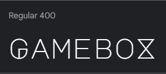

- The font used for remaining content is called "Jost", also imported from Google Fonts library. It uses sans-serif as a fallback font.

# Features

## MVP Features

Features have been split into pages or sections, as some pages are a feature of their own. Images have been provided accompanied with a short(ish) description. As there are quite a few features, if a feature does not have any significant change between either of the devices only one image will be shown, along with any additional information.

### Feature 0 - Authentication and AllAuth
Every page provided by allauth has been styled to fit the website theme, however as they aren't features I have created I am not necessarily counting them towards the total feature list.

1. AllAuth login with functioning* Google OAuth capabilities.

2. Sign-up Form

3. Sign-out Prompt

### Feature 0.33 - Navigation Bar

Simple navigation bar which is displayed on all pages. 

When a staff member is logged in the Admin button redirects them to `/admin/` while the button dropdown offers the ability to add games/dlcs, view media and add media.

- Navigation Bar - Desktop

Logged in as Staff

Logged in as User

Visiting as Guest

- Navigation Bar - Tablet and Mobile

Guest/User

- Burger Menu - Tablet and Mobile

Logged in as Staff

Guest/User
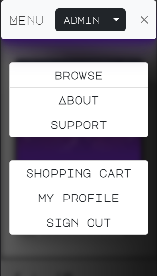

### Feature 0.66 - Footer

The footer offers a newsletter form which is hooked up to the back-end and stores a boolean value once the user submits their e-mail address in the form, as well as social links and a secondary navigation links section.

Desktop

Tablet

Mobile

### Feature 1 - Carousel with 3D Box effect (Home Page)

The carousel is capable of displaying games, DLCs and promotions. Each carousel item is an anchor and clicking on the image itself opens a new tab with the game or promotion's dedicated page. To ensure the user is not accidentally navigated away while trying to add an item to their cart the anchor element is not applied to the carousel section.

- Carousel - Desktop

Game/DLC

Game/DLC in Promo

Promo

- Carousel - Tablet (Layout)

Game/DLC

- Carousel - Mobile

Game/DLC

Game/DLC in Promo

Promo

### Feature 2 - Featured Games (Home Page)

Displayed featured games are picked from a pool of selected games/DLCs and different games are selected at each refresh by using `random.sample()` from Python's built-in `random` module. 

In tablet and mobile the displayed cards are limited down to 4 to fit layout.

Desktop

Tablet

Mobile

### Feature 3 - Deals of the Day (Home Page)

This feature displays the promotions which are expiring next, and are organized chronologically.

In mobile this feature turns into a side scroll and the countdown timer format moves from Days, Hours, etc. to the shorter D/M/Y/H/S.

Desktop

Tablet

Mobile

### Feature 4 - Games Page (Browse)

This is the primary page via which the user would be looking through games. It offers a filter so the users are able to find games which they would enjoy quicker. In addition, the games can be sorted by name, price, discount, release date, and rating.

- Full Page view

Desktop

Tablet

Mobile

- Games Filter

Desktop

Tablet

Mobile

- Sorting dropdown

Any Device

A sub-feature of the game page are the cards themselves. They are a 3D object which was achieved using CSS' `transform-style: preserve-3d` and `transform: transalateZ()`. The animation is applied through JavaScript by adding the class `.flip` to the game object. Once the animation is at least halfway through the back card becomes an anchor which is the user can use to navigate to the specific game's details page.

- Pre-flip the card shows the game's cover image on the front of the top card along with the game name, and the price on the reverse side of the back card. If the item is on Sale the card also displays the discount percentage and applies an image background which is custom made.
  * The image shown on the front of the card as a Media object is categorized as a 'COVER' image. Each game has 1 COVER image.
- Post-flip the card shows the game's attributes (name/tags/platforms/etc) along with the game's current rating on the front side of the back card, while the reverse side of the front card provides an input field to specify amount and a button to add an item to the cart.
  * In desktop the rating shows all 5 stars, while in mobile it only shows 1 star to fit the size of the card.
  * In mobile the add to cart button has it's text removed and replaced with the cart icon only.

Pre-flip

Pre-flip (Sale)
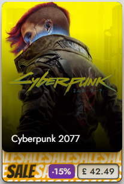

Post-flip (Desktop)

Post-flip (Mobile)

### Feature 5 - Game Page

The Game page is consists of 3 sub-features.

1. Page Header
- The image shown in the background is the same used for the carousel and as a Media object it is categorized as a 'LANDING' page. Each game has 1 chosen landing image.
- The rating system functionality is asynchronous via JavaScript. The `click` event sends an asynchronous request to a template-less view in the back-end. On response receipt, the overall game rating is updated.
- Each Platform anchor item opens the Game Attributes dedicated page.
- Each Genre anchor item redirects the user to the Browse page with the appropriate filter pre-set.

Desktop

Tablet

Mobile

2. Game Media Carousel
- The Game Media carousel is able to display images as well as videos. 
  * The videos are displayed using a modal. The video is loaded by default, so when the user opens the modal it's going to have it's url set. As modals are simply hidden from screen and not inexistent, once the video is closed normally the video would continue playing until the page is refreshed. To prevent that, I have created a function which on modal close removes the iframe url, waits a second, and then adds it back, so the user can watch the video again if they wish.
  * The carousel shows 1 image at a time on mobile and tablet, and two in Desktop.

Desktop (Both)

Desktop (Modal)

 

Tablet (Image)

Tablet (Video)

Tablet (Modal)

 

Mobile (Image)

Mobile (Video)

Mobile (Modal)
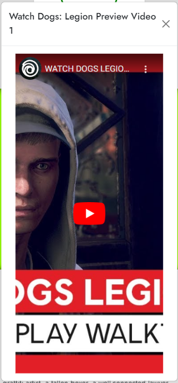

3. Game Information
- Each Developer and Publisher anchor item opens the Game Attributes dedicated page.
- Each Tag and Feature anchor item redirects the user to the Browse page with the appropriate filter pre-set.
- Related content shows any DLCs that the game may have, or the game the DLC requires to be played, that are offered on the website. On click, opens a new tab and loads the specific game page.

Desktop

Tablet

Mobile

### Feature 6 - Game Attribute Page

This page displays a company's page. Each attribute has it's own logo, a short introduction, a link to official website as well as the country of origin.
- Any Developer, Publish, or Platform item redirects the user to this page.
- Games are displayed in a table and paginated with up to 5 games per page, as well as lite sorting functionality based on Name, Discount, or Price.

Any Device

### Feature 7 - About Page

About page is static and is used to provide the users with a short introduction to the business' goals, values, and story.

Desktop/Tablet

Mobile

### Feature 8 - Support Page

Support page is the second and last static page on the website and is used to provide users with answers to frequently asked questions.
- This page uses a control-less Bootstrap carousel to display answers and the standard carousel pips have been transformed into the questions. Once the member clicks on a questions, whoosh comes in flying the answer.

Desktop/Tablet (Empty)

Desktop/Tablet (Clicked)

Mobile (Clicked)

### Feature 9 - Cart Page

This page is used to display the games the user has added to their cart. This page has 3 separate versions depending on whether the cart was empty when the user navigated to it.

- <small>*Empty Start - the user's cart was empty and they navigated to the cart page.</small>
- <small>*Full Start - the user's cart was full, but they removed all items.</small>

Desktop

Desktop (Empty Start)

Desktop (Full Start)

 

Tablet

Tablet (Empty Start)

Tablet (Full Start)

 

Mobile

Mobile (Empty Start)

Mobile (Full Start)

### Feature 10 - Checkout Page

This page is the last stop on the road to completing a purchase. On this page the users will verify their order, input their billing information, and submit payment.

I have removed the ZIP code field from the Stripe card element as it's not relevant for the business. To prevent the user from creating multiple payment intents if they were navigating back and forth, the payment intent is not created until they click on the "Pay Now" button. Once clicked, the button triggers a submit event which calls the back-end asynchronously twice, once to create the payment intent, and then to update it with the billing address.

If the site visitor is a guest, the form features an invite for them to login or create an account. If the visitor logs in their session cart is merged to their existing user database-based (database'd?) cart.

Alternatively if the user is already logged in the form will feature a "save as default" checkbox which allows them automatically update their account information. If they user decided they wanted to provide a one-time alternative billing address, they can untick the box.

Desktop (Guest)

Desktop (User)

Tablet (Guest)

Tablet (User)

Mobile (Guest)

Mobile (User)

### Feature 11 - Checkout Success Page

Once the user clicks 'Pay Now' on the checkout page, if they payment is successful, they are redirected to this page.
When redirected to the the checkout page, in the back-end the `checkout_success` view sends the user an e-mail containing their order along with the pseudo serial keys that you would generally expect in a digital video game store confirmation e-mail. The page itself displays the user's order number, a button to go back to the browse page, as well as a few suggested games which were not part of the user's cart. As the site does not _yet_ have a system to record the user's actions to assist in actually suggesting games, the suggested games use the same functionality (`random.sample()`) as featured games on home page.

- Order Confirmation

Desktop/Tablet

Mobile

- "Suggested Games"

Desktop/Tablet

Mobile

### Feature 12 - Profile _Pages_

The profile app is considered as one big feature with each of the pages available in the account navigation being sub-features, which includes any of the additional templates provided by AllAuth.

#### Sub-feature - Profile/My Profile

This is the first page that the user is redirected to when the click the navigation bar "My Profile" button. This allows the user to change their first and last names as well as _view_ their username and registered email address, their last logged in date and time as well as their date joined/registered.

Desktop/Tablet

Mobile

#### Sub-feature - Billing Address

Desktop/Tablet

Mobile

#### Sub-feature - Styled AllAuth Templates

- Change Password

Any Device

- Account Connections (OAuth)

Any Device

- Email Addresses

Any Device

### Feature 13 - Media View Page and Media Forms (Staff Only)

Media is organized and categorized by Media Type (Image/Video) and Media Use (Cover/Landing/Preview/Other):

1. Cover - Narrow image
2. Landing - Wide-screen image
3. Preview - Used for the individual game page carousel.
4. Other - Media that has not been assigned as Cover/Landing/Preview media, but exists in the AWS S3 bucket.

- Media View

This page displays any Assigned or Unassigned media instances and allows the user to either edit or delete any of the media on the website. At present neither of the containers has search functionality as the game-base currently available is relatively small, however it is currently logged as a post-MVP feature.

Desktop/Tablet

Mobile

- Media Form

Desktop/Tablet (Add)

Desktop/Tablet (Edit)

Mobile (Add)

Mobile (Edit)

### Feature 14 - Promo Page

Promo page is one of the signature features of the site and is created for the user to be able to view all games that have been discounted. As the promos are generally themed, although page-less promos are available, users can more or less guess what games might be included (e.g. Action-packed Sale, Scream! Sale).

- Header

Desktop

Tablet

Mobile

- Carousel

Desktop

Tablet

Mobile

- Table

Desktop

Tablet

Mobile

### Feature 15 - Game/DLC Forms

The website offers the ability to add games and DLCs via the site itself as well. The Game and DLC forms are almost identical with the exception of the DLC form having a `required_game` foreign key field.

- ADD

Desktop

Tablet

Mobile

- EDIT

Desktop

Tablet

Mobile

# Technologies

|Technology | Specification |
|---|---|
|Operating System | Windows 10 x64|
|IDE | Visual Studio Code |
|Version Control| Git |
|Deployment | Heroku |
|Image Storage | AWS S3 Buckets |
|Database Host | ElephantSQL (PostgreSQL) |
|Full-Stack Framework | Django |
|Languages | HTML5, CSS3, JavaScript, & Python |
|Font - Headings | [Major Mono Display](https://fonts.google.com/specimen/Major+Mono+Display?query=Major+Mono+Display) |
|Font - Other | [Jost](https://fonts.google.com/specimen/Jost?query=jost) |
|Font - Fallback | sans-serif |
|Responsive Mockup | [Am I Responsive](https://ui.dev/amiresponsive) |

# Testing

## HTML Validation

[W3C Markup Validation Service](https://validator.w3.org/) was used to validate the HTML of the website. 

As I have used Django templating, similarly to Jinja, in order to validate the HTML for most pages I navigated to each page and used the "View Page Source" functionality, copied and then pasted the generated code into the validator.

I have scrolled the code in the input field on the validation tool so you can tell what is being validated.

### Home App

Home Page - index.html

Media View Page - media_list.html

Media Add/Edit Page - media-crud.html

About - about.html

Support - support.html

### Games App

* The raised "stray `div`" errors are due to Django templating. I have gone over each and verified they are not stray.

Browse - index.html

Game/DLC Page - game.html

Game Add/Edit Page - game_crud.html 

Game Attribute Page - game_attr.html

### Promo App

* The raised "stray `div`" errors are due to Django templating. I have gone over each and verified they are not stray.

Promo Page - index.html

### Cart App

Empty Cart - index.html

Full Cart - index.html

### Checkout App

Checkout - index.html

Checkout Success - checkout_success.html

### Profiles App

User Information Page - index.html

Checkout Success - checkout_success.html

## CSS Validation

[W3C CSS Validation Service](https://jigsaw.w3.org/css-validator/) was used to validate the CSS of the website.

Primary Styles - style.css

## JavaScript Validation

[JS Hint](https://jshint.com/) was used to validate the JavaScript of the website.

### Base

Messages To Toast - index.html

I was unable to define the bootstrap (Bootstrap5) variable as it is injected via a third-party library.

Games Flip - games.js

### Home App

3D Box Effect - index.html

Media View - game/media_list.html

### Games App

Browse Filter - index.html

* I was unable to define the noUiSlider and wNumb variables as they are injected via a third-party libraries.

Browse Filter (Mobile Layout Setup) - index.html

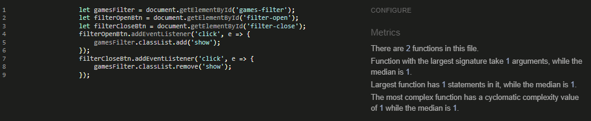

Browse Sorting - index.html

Browse Pagination Input - index.html

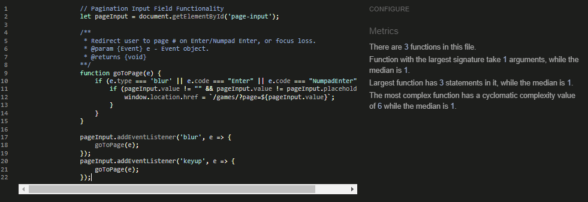

Tempus Dominus Date Picker - game_crud.html

* I was unable to define the tempusDominus (Tempus Dominus) variable as it is injected via a third-party library.
* `pickerReleaseDate` is shown as not used, however this is what the Tempus Dominus documentation shows that the input fields should be defines as.

Select2 Multiselect Input - game_crud.html

### Promo App

Table Anchors - index.html

### Cart App

Item Remove Button - index.html

* I was unable to define the bootstrap (Bootstrap5) variable as it is injected via a third-party library.
* `tooptipList` configures each tooltip item on the page, as shown within Bootstrap 5.2 documentation.

Table Anchors - index.html

### Checkout App

Stripe - index.html

## Python Validation 

[CI Python Linter](https://pep8ci.herokuapp.com/) was used to validate Python code for PEP8 compliance.

### Home App

admin.py

apps.py

forms.py

models.py

signals.py

tests_forms.py

tests_models.py

tests_views.py

views.py

### Games App

admin.py

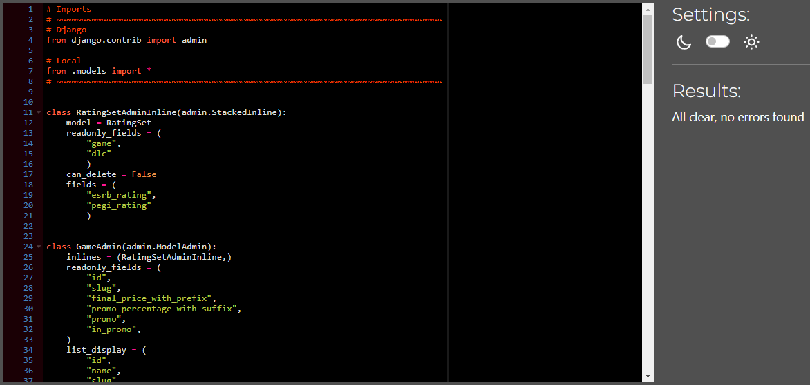

apps.py

forms.py

models.py

tags.py

tests_forms.py

tests_models.py

tests_views.py

urls.py

utils.py

views.py

### Promo App

admin.py

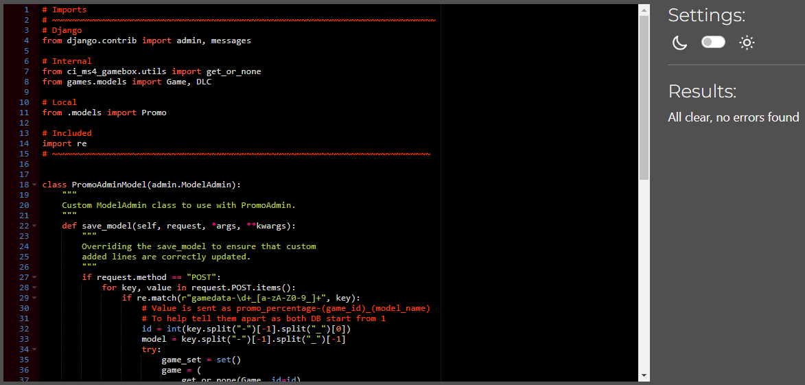

apps.py

models.py

promo_tags.py

signals.py

tests_models.py

tests_views.py

urls.py

urls.py

views.py

### Cart App

admin.py

apps.py

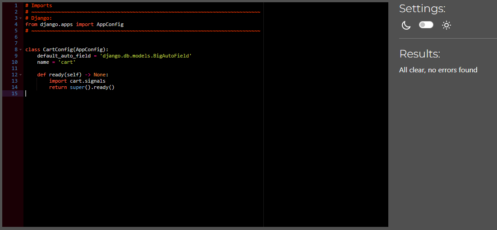

context.py

models.py

signals.py

tests_models.py

tests_views.py

views.py

### Checkout App

admin.py

apps.py

forms.py

models.py

signals.py

tests_forms.py

tests_models.py

tests_views.py

urls.py

views.py

webhook_handler.py

webhooks.py

### Profiles App

admin.py

apps.py

context_processors.py

forms.py

models.py

signals.py

tests_forms.py

tests_models.py

tests_views.py

urls.py

views.py

## Accessibility

[WAVE WebAIM Web Accessibility (Chrome Plugin)](https://chrome.google.com/webstore/detail/wave-evaluation-tool/jbbplnpkjmmeebjpijfedlgcdilocofh) was used to check that the code meets accessibility standards.

- Every input field on the website has a placeholder configured, however because the newsletter and billing address do not have a label element it is being raised as an error.
- Contrast Errors are raised as the tool assumed that the text is placed on a light background as the image has absolute position. Where text is floating and the background color is not predictable I have tried adding, hopefully sufficient, styling so there is enough contrast at any point.

Home Page

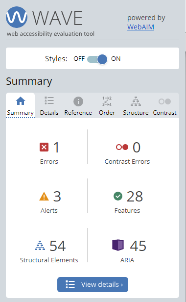

Game/DLC

Games/Browse

Game Attributes Page

Game Add/Edit

Promo

Cart

Checkout

Checkout Success

View Media

Media Add/Edit

Profile

Billing Address

About

Support

## Performance Testing

While the images on the website are not currently optimized, this presents an exciting opportunity for post-MVP improvements. 

Home Page

Game/DLC

Games/Browse

Game Attributes

Game Add/Edit

Promo

Cart

Checkout

Checkout Success

View Media

Media Add/Edit

Profile

Billing Address

About

Support

## Unit and User Story Testing

User and Unit Testing (Coverage) are documented in [TESTING.md](TESTING.md)

# Bug Log
| ID | Description | Status |
|---|---|---|
| 1 | Carousel buttons obstructing Add to Cart button due to Z-index and `top: 0; bottom: 0;` styling. | Resolved |
| 2 | Start and end date fields of Promo objects default value is being re-evaluated as a new default value, causing both fields to be migrated each time. | Resolved |
| 3 | When a user hovers and moves their mouse around in the reverse of the back card (purple card, contains the price) it causes the animation to restart. | Unresolved |

# API Configuration

## Django Mail with Google Email

To set up the project to send emails and use a Google account as an SMTP server, the following steps are required:

1. Login, or create, your Google account by navigating to [Google Mail](https://www.gmail.com/)
2. Navigate to [Google - My Account](https://myaccount.google.com/) and click on the Security button in the left-side menu.
3. To proceed, you will need to have, if you don't already, 2-Step Verification. Simply click on "2-Step Verification" and follow the instructions.
4. Use the search bar to navigate to the "App passwords" page.

5. Select an App and a Device from the dropdown menus, then click on "Generate" to create your app password.

6. Make note of the 16-digit generated app password.
6. In your env.py file, create an environment variable called EMAIL_HOST_PASS and assign it the 16-digit app password noted earlier.
7. In your env.py file, create an environment variable called EMAIL_HOST_USER and assign it your Gmail e-mail address.
8. Now you can use `send_mail("Subject here", "Here is the message.", "from@example.com", ["to@example.com"], fail_silently)` in your views to send e-mails.
9. Once e-mail has been setup, to ensure that during development the local server does not send e-mails via Google, it is recommended that the below code is added to your `settings.py`.

## Stripe API

1. Register an account at [Stripe](https://www.stripe.com).
2. At the top right corner, click on "Developers" then click on the API keys tab.
3. Take note of your publishable and secret keys.
4. In your local environment variables file (env.py) and Heroku - create new environment variables called `STRIPE_PUBLIC_KEY` and `STRIPE_SECRET_KEY` and populate them with your keys from the previous step.
5. Click on the Webhooks tab then create a new webhook endpoint using your webhook endpointURL (i.e. "https://ci-ms4-gamebox.herokuapp.com/checkout/wh/")
6. For events to send, the two most important are `payment_intent.payment_failed` and `payment_intent.succeeded`; however, you can also select all. Take note of the webhook secret provided.
7. In your in your local environment and Herok, add a new environment variable called `STRIPE_WH_SECRET` and assign it your webhook secret.

# Deployment

There is a number of application that are required in order to run this application locally or on a cloud based service like Heroku.

## Amazon Web Services S3 Bucket

1. Create an account at [Amazon AWS](https://aws.amazon.com/).
2. Open the navigation bar menu 'Services' (top-left) and select 'IAM'. If you can't find it, you can use the search bar.
3. Create a new user with an `AmazonS3FullAccess` policy assigned.
4. Through 'Services' menu, navigate to [Storage > S3] and create a new bucket. For the purpose of this application the bucket name is "ci-ms4-gamebox", but this can later be changed.
5. Go into your bucket's Permissions tab and setup that the bucket to have Public Accesss and is visible to others. Consult the AWS documentation if required!
6. The bucket should now be ready to use with your application, however you will need to configure your application to use S3 buckets to store your media and static files:

## Local Deployment

1. Login, or create an account, on Github.
2. Find and open the CI_MS4_GB repository.
3. Click the 'Code' button and copy the HTTPS link to use with Git.
4. In your own IDE, open a terminal and run the following command to clone the repository:
- `git clone https://github.com/NyxHexen/CI_MS4_GB.git`
5. Depending on your IDE, the new local version of the repository will automatically open.
6. Create an `env.py` file, populate it, and add it to your `.gitignore` file, to make sure it is not committed with your code, as it contains sensitive information.
7. Install the relevant packages by running:
- `pip install requirements.txt`
8. Start the application by running:
- `python manage.py runserver`

# Credits

## Code Content

1. Corey Schafer and his [Django Tutorial Playlist](https://www.youtube.com/watch?v=UmljXZIypDc&list=PL-osiE80TeTtoQCKZ03TU5fNfx2UY6U4p) which was helpful in the beginning stages of creating the app.
2. [StackOverflow - Storing lambdas in a dictionary](https://stackoverflow.com/questions/14419925/storing-lambdas-in-a-dictionary) which inspired the games filtering dictionary.
3. [W3 Schools](https://www.w3schools.com/graphics/svg_polygon.asp) - SVG Tutorial
4. [Algolia](https://www.algolia.com/doc/guides/managing-results/must-do/custom-ranking/how-to/bayesian-average/#the-difficulties-with-calculating-a-reliable-rating) not so much for the code, but for providing the Bayesian Average formula which was used in the `user_rating_calc()` method. When looking around for a rating system a lot of people are using Pandas, but when dealing with a small amount of data I thought it would be easier to use plain Python.
5. [CodeInstitute](https://codeinstitute.net/) - Stripe webhook and webhook handler. Followed along with video and then customized to fit my app.

## Media Content

1. [IGDB](https://www.igdb.com/) - Text content and images for each game.
2. [Google Images](https://images.google.com/) - Promo images.
3. [Favicon](https://favicon.io/) - Used to generate webpage favicon.
4. [Font Awesome](https://fontawesome.com/) - Icons used in project.
5. [Google Fonts](https://fonts.google.com/) - Fonts used in project.
6. [YouTube](https://youtube.com/) - Video Media images (specifically this StackOverflow post [clickme!](https://stackoverflow.com/questions/2068344/how-do-i-get-a-youtube-video-thumbnail-from-the-youtube-api))

## Acknowledgements
- As always, special thank you to my mentor Mo Shami for all the encouragement and support!