# Table of Contents

# Unit Testing

Automatic testing on forms, models, and views has been conducted using Django's built-in test command and the third-party library "Coverage" which was used to measure testing completion.

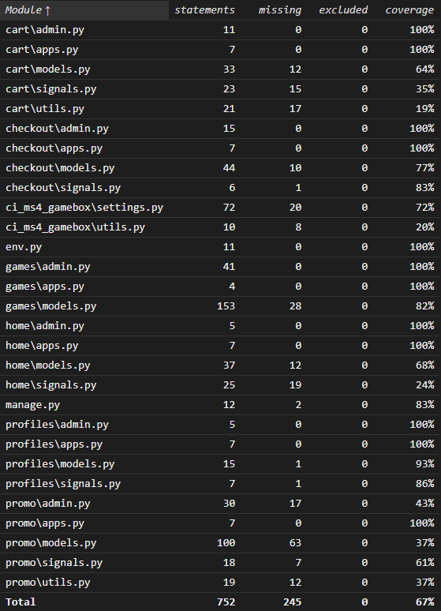

# Compatibility Testing

## Browser Compatibility

- Opera/Opera GX: Functionality and styles as expected.
- Google Chrome: Functionality and styles as expected.
- Firefox: Functionality and styles as expected.
- Microsoft Edge: Functionality and styles as expected.
- Google Chrome Mobile: Functionality and styles as expected.

## Devices tested on

- Tower desktop with 27" monitor;
- OnePlus 9 Pro.

# User Stories Testing

A1. As an admin/site owner, I want potential users to be able to register for an account.
B2. As a potential/new user, I want to be able to register for a new account.

| Feature | Action | Expected Result | Actual Result
|--- |--- |--- |---
| Navigaton Bar | From any page click on the 'Sign Up' on the navigation bar which takes you to the Sign Up Form | User is able to navigate to sign up page by clicking on Sign Up button and can sign up successfully. | As expected.

 Supporting Images 

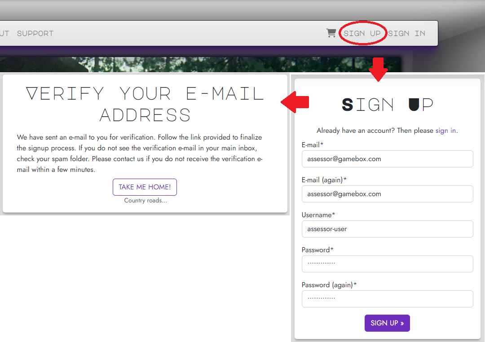

A2. As an admin/site owner, I want existing users to be able to login.
B3. As a potential/new user, I want to be able to log in to my newly created account.
C1. As an existing user, I want to be able to login.

| Feature | Action | Expected Result | Actual Result
|--- |--- |--- |---
| Navigaton Bar | From any page click on the 'Sign In' on the navigation bar which takes you to the Sign In Form | User is able to navigate to sign in page by clicking on Sign Up button and can sign-in successfully. | As expected.

 Supporting Images 

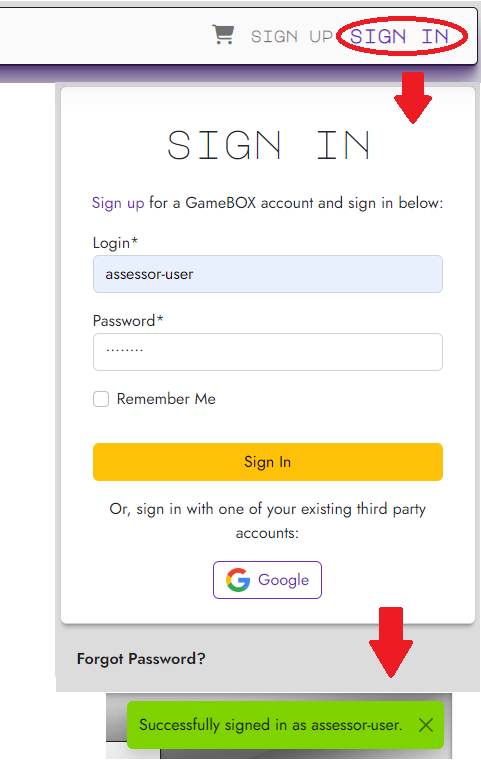

A3. As an admin/site owner, I want existing users to be able to change their password.
C2. As an existing user, I want to be able to change my password.

| Feature | Action | Expected Result | Actual Result
|--- |--- |--- |---
| Navigaton Bar | While logged in, from any page click on the 'My Profile' on the navigation bar, then on the Account Navigation menu, click Change Password. Once on the "Change Password" page, fill in your old password and your new password twice and submit the form. | User is able to successfully change their password. | As expected.

 Supporting Images 

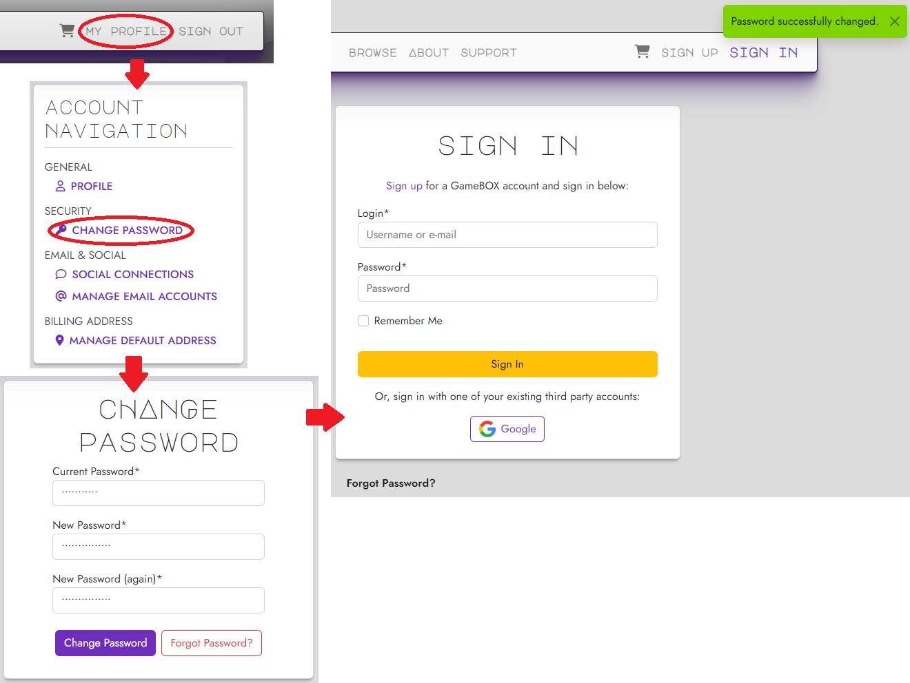

A4. As an admin/site owner, I want existing users to be able to recover their password if forgotten/lost.
C3. As an existing user, I want to be able to recover my password if forgotten/lost.

| Feature | Action | Expected Result | Actual Result
|--- |--- |--- |---
| Navigaton Bar | From any page, click on Sign In navigation bar button. Once there, at the bottom of the Sign Up form, click on the "Forgotten Password?" button, which redirects to the "Password Reset" form. Input your e-mail address, and if an account is registered an e-mail containing a reset-token link will be sent. | User is able to successfully recover their password by utilzing the "Password Reset" form. | As expected.

 Supporting Images 

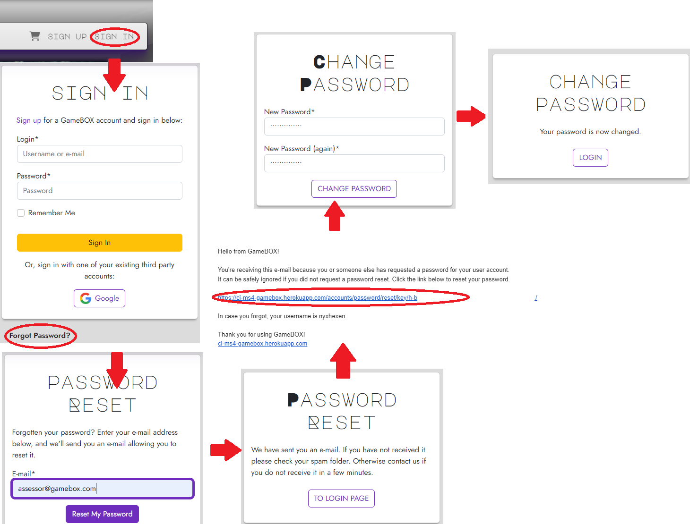

A5. As an admin/site owner, I want existing users to be able to store their default billing details on the website.
C4. As an existing user, I want to be able to store my billing information on in the account, so I don't have to type it out every time.
C5. As an existing user, I want to be able to be able to edit my billing information.

| Feature | Action | Expected Result | Actual Result
|--- |--- |--- |---
| Navigaton Bar | While logged in, from any page click on the 'My Profile' on the navigation bar, then on the Account Navigation menu, click Manage Default Address. Once on the "Billing Address" page, update your address using the form as needed. | User is able to successfully add/edit their default billing details. | As expected.

 Supporting Images 

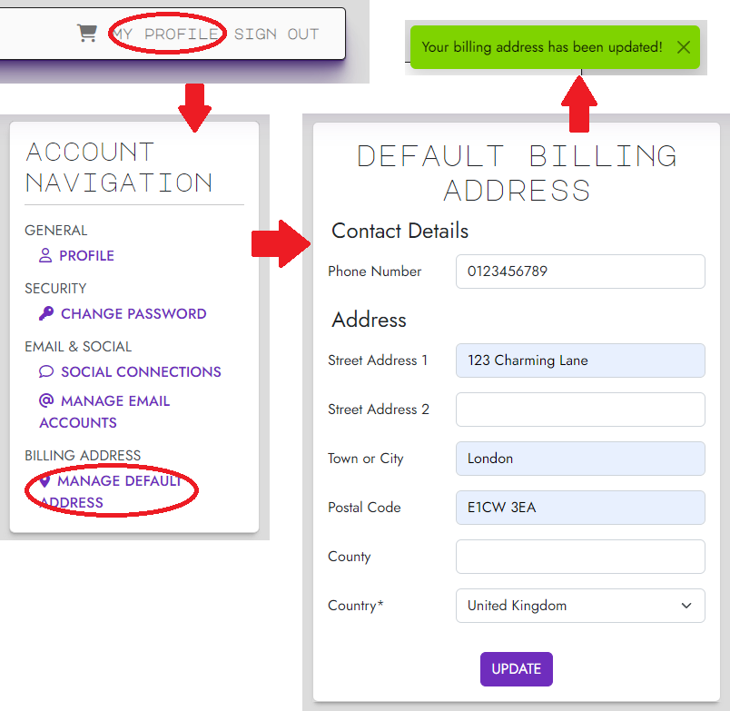

A6. As an admin/site owner, I want potential users to be able to sign-up with their third-party vendor login details.
A7. As an existing user, I want to be able to manage my third-party authentication accounts.

| Feature | Action | Expected Result | Actual Result
|--- |--- |--- |---
| Navigaton Bar | While logged in, from any page click on the 'My Profile' on the navigation bar, then on the Account Navigation menu, click "Social Connections". Once on the "Social Connections" page, click on the Google button. | User is able to successfully add or remove their Google Account. | As expected.

 Supporting Images 

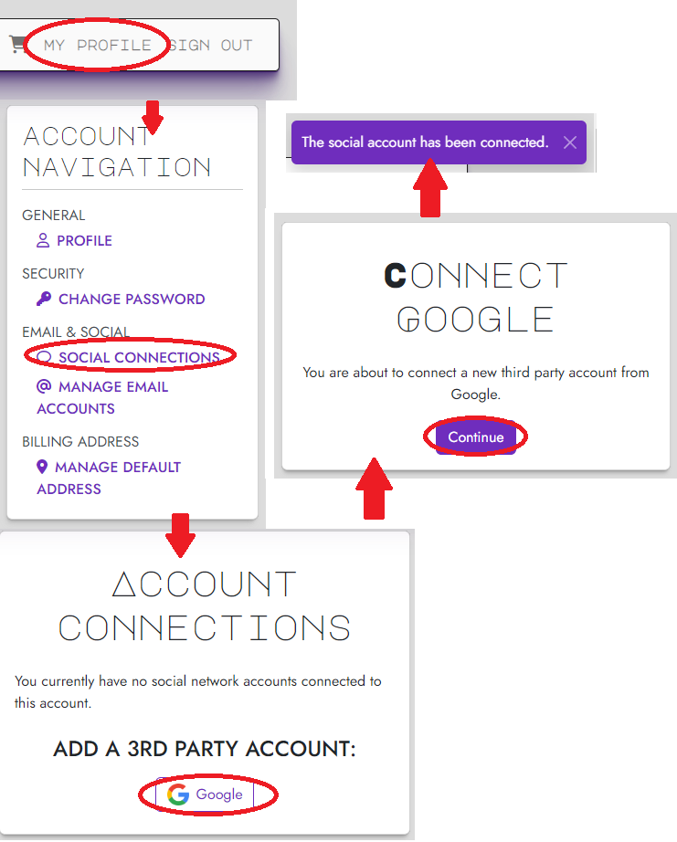

A7. As an admin/site owner, I want all users to be able to contact us via e-mail.
B5. As a potential/new user, I want to be able to be able to contact the site owners/admins.
C9. As an existing user, I want to be able to contact the site owners/admins.

| Feature | Action | Expected Result | Actual Result
|--- |--- |--- |---
| Footer | From any page, scroll to the bottom of the page to get to the footer, then click on the e-mail address anchor link, which will automatically open your default mailing application. Alternatively, copy and paste the e-mail address in the To field of a new e-mail in your preferred mailing application.| User is able to successfully send an e-mail to the site owners/administrators. | As expected.

 Supporting Images 

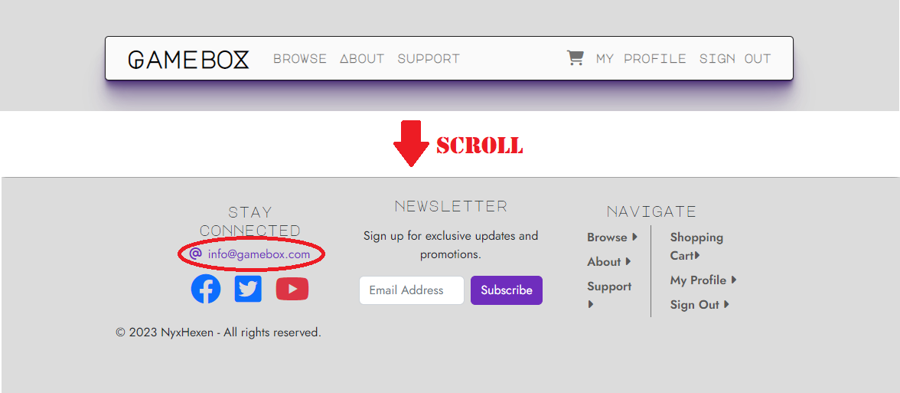

A8. As an admin/site owner, I want all users to be able to receive support through a FAQ page.

| Feature | Action | Expected Result | Actual Result
|--- |--- |--- |---
| FAQ Page | From any page, click the "Support" button on the navigation bar which will redirect you to the "Support Page". Once redirected, click on the question relevant to you and a card will slide in to answer it.| User's questions are successfully addressed using the FAQ section. | As expected.

 Supporting Images 

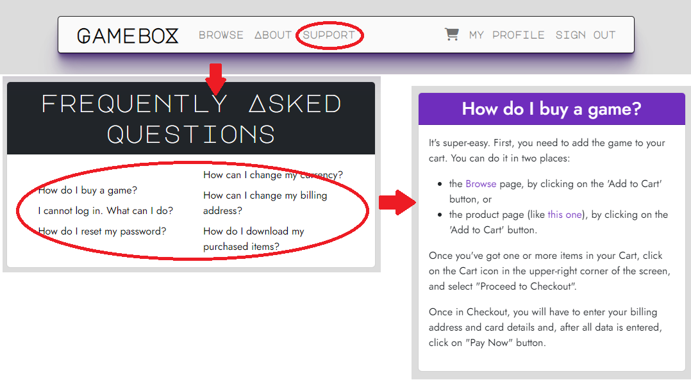

A9. As an admin/site owner, I want potential users to know from the start what the purpose of the website is.
B1. As a potential/new user, I want to know the site's purpose from the moment I visit the site.

| Feature | Action | Expected Result | Actual Result
|--- |--- |--- |---
| Home Page | None | Due to the nature of the website the user is able to immediately determine the site's goal and purpose. | As expected.

 Supporting Images 

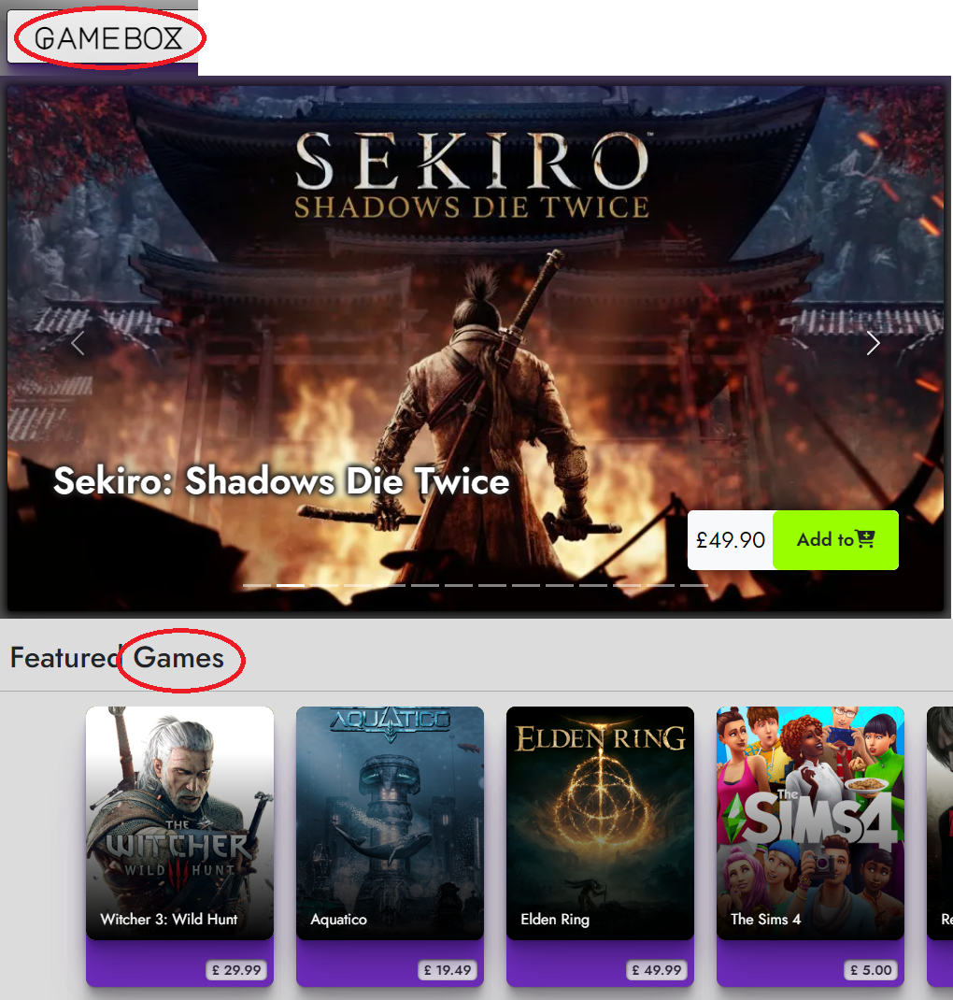

A10. As an admin/site owner, I want all users to be able to browse our products.

| Feature | Action | Expected Result | Actual Result
|--- |--- |--- |---
| Any | From any page, click the "Browse" button on the navigation bar. You will then be redirected to the browse page. | User is able to successfully locate the Browse page. | As expected.

 Supporting Images 

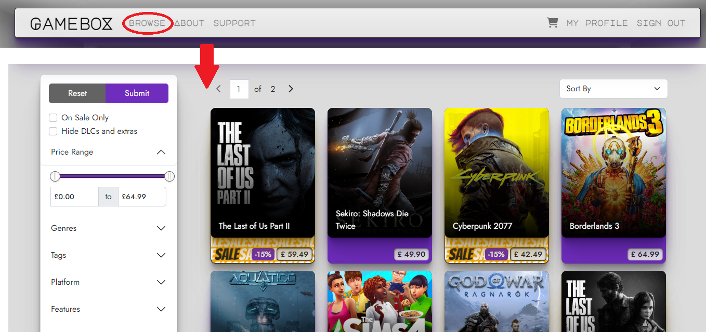

A11. As an admin/site owner, I want all users to be able to explore our promotions (sales).
B7. As a potential/new user, I want to be able to explore the available promotions (sales).
C11. As an existing user, I want to be able to explore the available promotions (sales).

| Feature | Action | Expected Result | Actual Result
|--- |--- |--- |---
| Home Page | From the Home page, scroll to the bottom to locate the "Deals of the Day" section, which contains all currently available promotions. Each promotion redirects to a dedicated promotion page where the user can view all games included in the promotion. | User is successfully able to locate and browse the current available promotions. | As expected.

 Supporting Images 

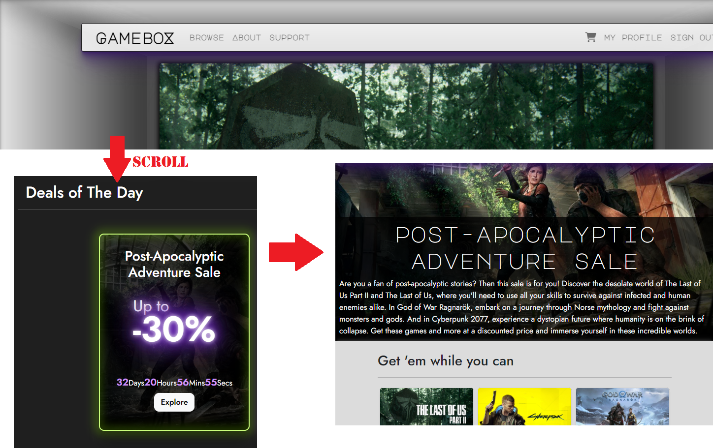

A12. As an admin/site owner, I want all users to be able to view our company story/mission.
B4. As a potential/new user, I want to be able to find out more about the company behind the site.

| Feature | Action | Expected Result | Actual Result
|--- |--- |--- |---
| About Page | From any page, click the "About" button on the navigation bar which will redirect you to the "About" Page. Once redirected, the company's information will be available to view. | User is able to learn more about the company by visiting the "Support" page. | As expected.

 Supporting Images 

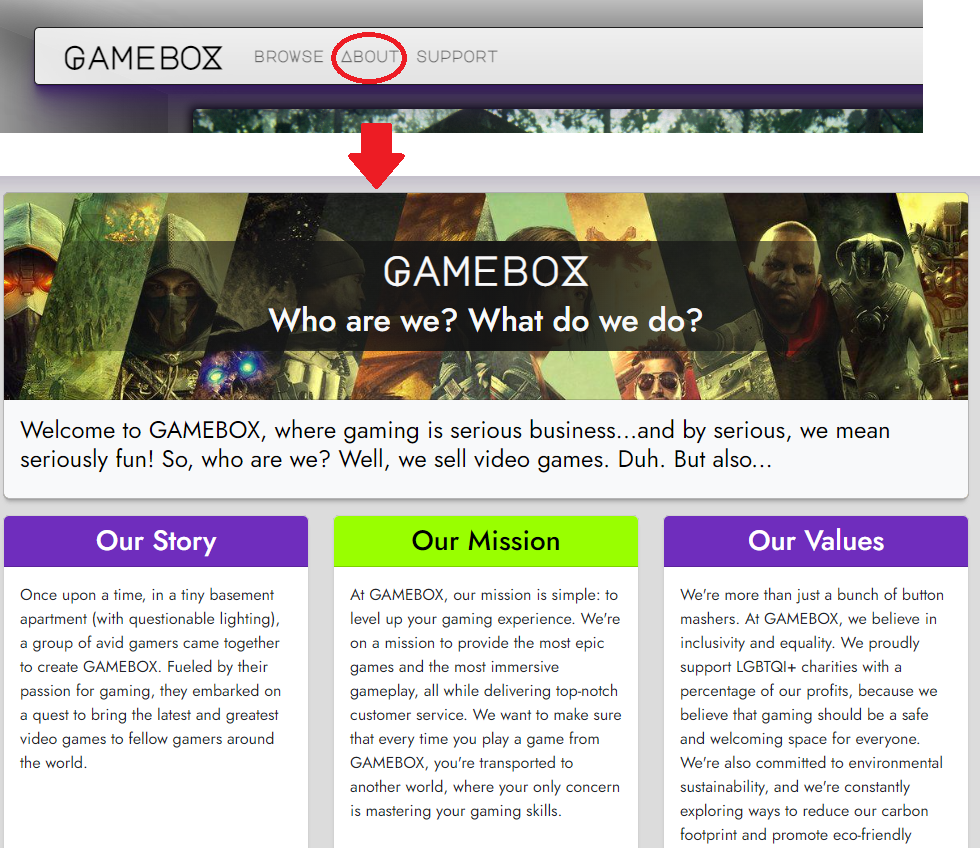

A13. As an admin/site owner, I want all users to be able to filter products.
B9. As a potential/new user, I want to be able to filter products by different criteria (e.g. tags, features, platforms).
C14. As a potential/new user, I want to be able to filter products by different criteria (e.g. tags, features, platforms).

| Feature | Action | Expected Result | Actual Result
|--- |--- |--- |---
| Browse Page | From any page, click the "Browse" button on the navigation bar which will redirect you to the "Browse" page. Once on the "Browse" page, user the filter on the left side of the page (or the filter button to bring up the filter) to select the preferred filtered criteria. Once selection is finalized, click on "Submit" button to view filtered games. | User is able to successfully filter the games on "Browse" page. | As expected.

 Supporting Images 

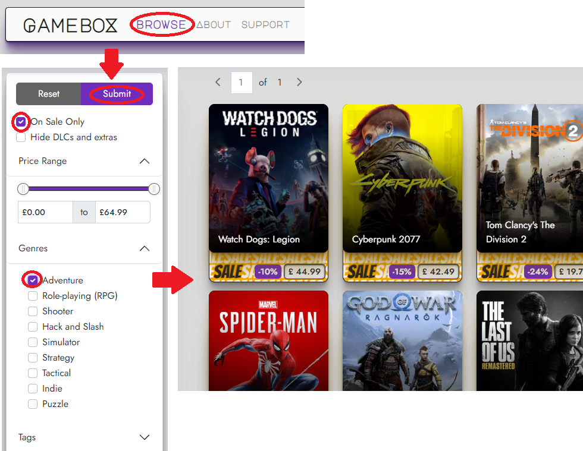

A14. As an admin/site owner, I want all users to be able to find information about a specific product through a dedicated page.
B14. As an potential/new user, I want to be able to view details of a product.
C18. As an existing user, I want to be able to view details of a product.

| Feature | Action | Expected Result | Actual Result
|--- |--- |--- |---
| Game Details Page | From any page featuring any games (home carousel, featured games, etc.), click on the game to open the "Game Details" page in a new tab which lists all information about the game. | User if successfully able to navigate to the "Game Detail" page by clicking on a game of their picking, to view the game's information. | As expected.

 Supporting Images 

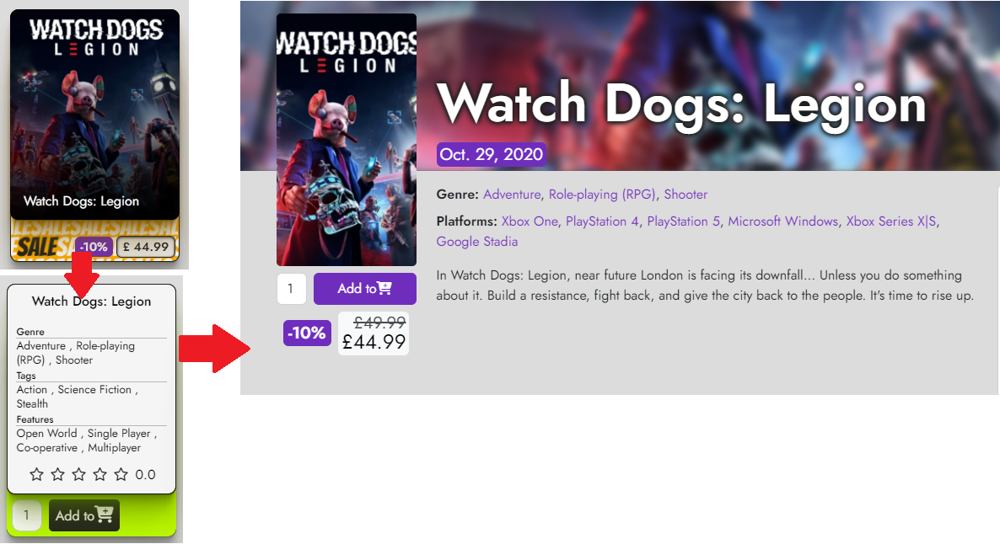

A15. As an admin/site owner, I want to be able to add new Media content through the main website.

| Feature | Action | Expected Result | Actual Result
|--- |--- |--- |---
| Media Add/Edit Page | From any page, while signed in as staff or superuser, click on the Admin button dropdown dropdown and select Add New Media, which will redirect you to the New Media form. Populate appropriate fields then click Save and Exit to save the new media object. | Staff/Superuser is able to successfully add a new media object to the website. | As expected.

 Supporting Images 

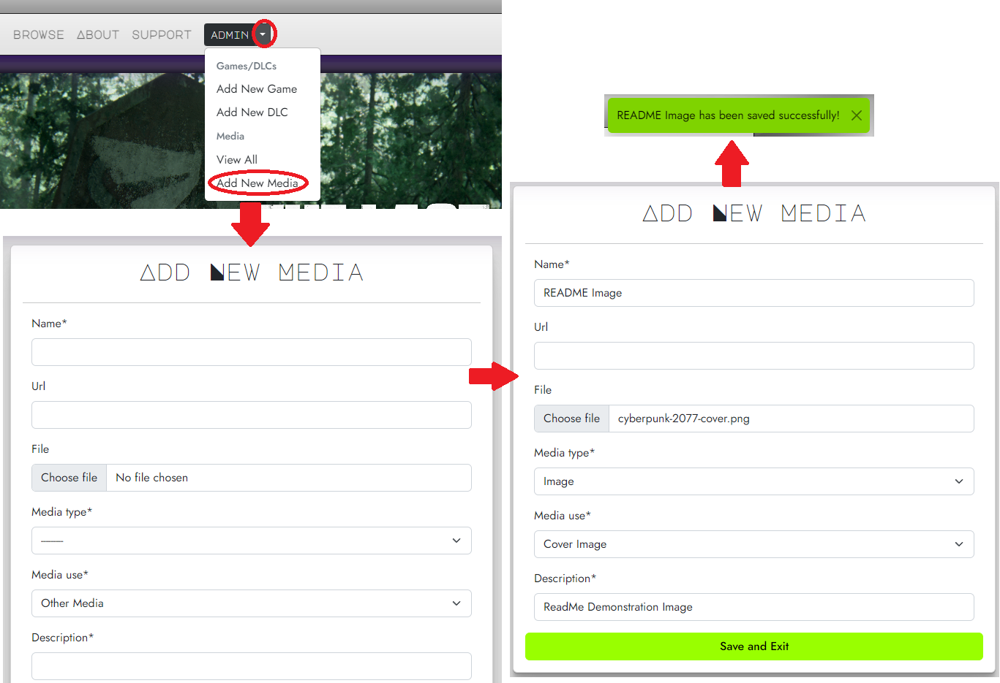

A16. As an admin/site owner, I want to be able to edit Media content through the main website.

| Feature | Action | Expected Result | Actual Result
|--- |--- |--- |---
| Media Add/Edit Page | From any page, while signed in as staff or superuser, click on the Admin button dropdown dropdown and select View All Media, which will redirect you to the Media page. Once there, locate the media object you are looking to edit and click the "Edit" button to navigate to the Edit Media form. Once changes have been made, click on Save and Exit to save the changes.  | Staff/Superuser is able to successfully edit a media object via the front-end. | As expected.

 Supporting Images 

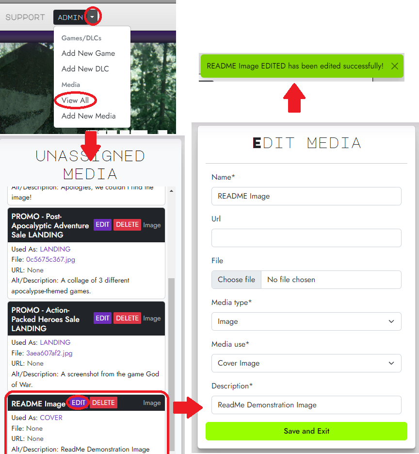

A17. As an admin/site owner, I want to be able to delete Media content through the main website.

| Feature | Action | Expected Result | Actual Result
|--- |--- |--- |---
| View Media Page | From any page, while signed in as staff or superuser, click on the Admin button dropdown dropdown and select View All Media, which will redirect you to the Media page. Once there, locate the media object you are looking to delete and click the "Delete" button to trigger the delete modal. Once you click "Delete Media" on the modal the object will be removed from the DB. | Staff/Superuser is able to successfully delete a media object via the front-end. | As expected.

 Supporting Images 

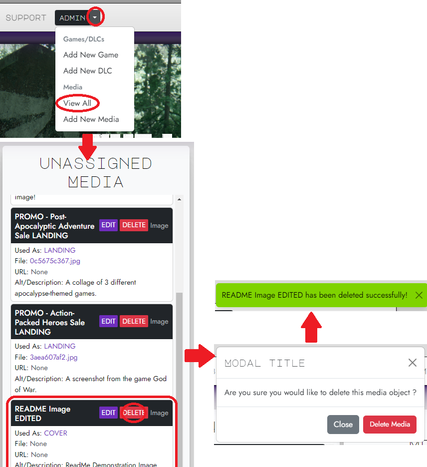

A18. As an admin/site owner, I want to be able to add new Game/DLC content through the main website.

| Feature | Action | Expected Result | Actual Result
|--- |--- |--- |---
| Game Add/Edit Page | From any page, while signed in as staff or superuser, click on the Admin button dropdown dropdown and select "Add New Game" or "Add New DLC", which will redirect you to the New Game page. Once redirected, you will be presented with a form to complete for the game you wish to add. | Staff/Superuser is able to successfully add a Game or DLC object via the front-end. | As expected.

 Supporting Images 

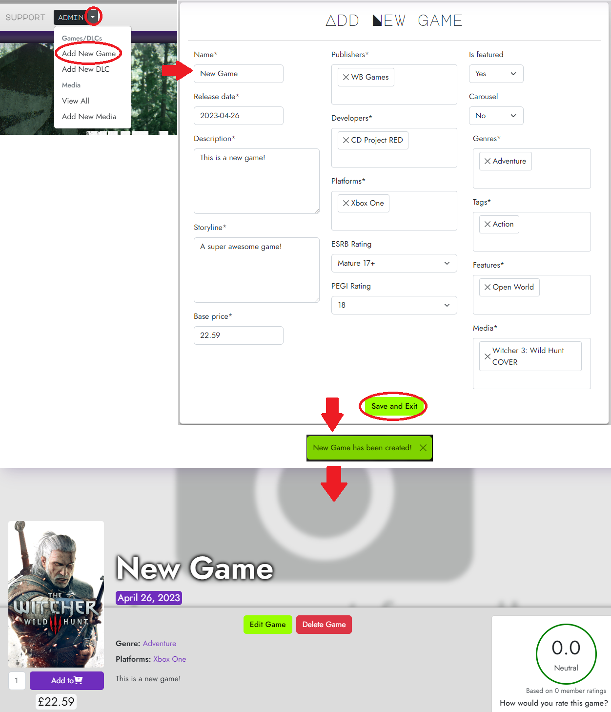

A19. As an admin/site owner, I want to be able to edit Game/DLC content through the main website.

| Feature | Action | Expected Result | Actual Result
|--- |--- |--- |---
| Game Add/Edit Page | Click on any game to open the Game Details page while logged in as staff/superuser, then click on the "Edit Game" to be redirected to the "Edit Game Form" | Staff/Superuser is able to successfully add a Game or DLC object via the front-end. | As expected.

 Supporting Images 

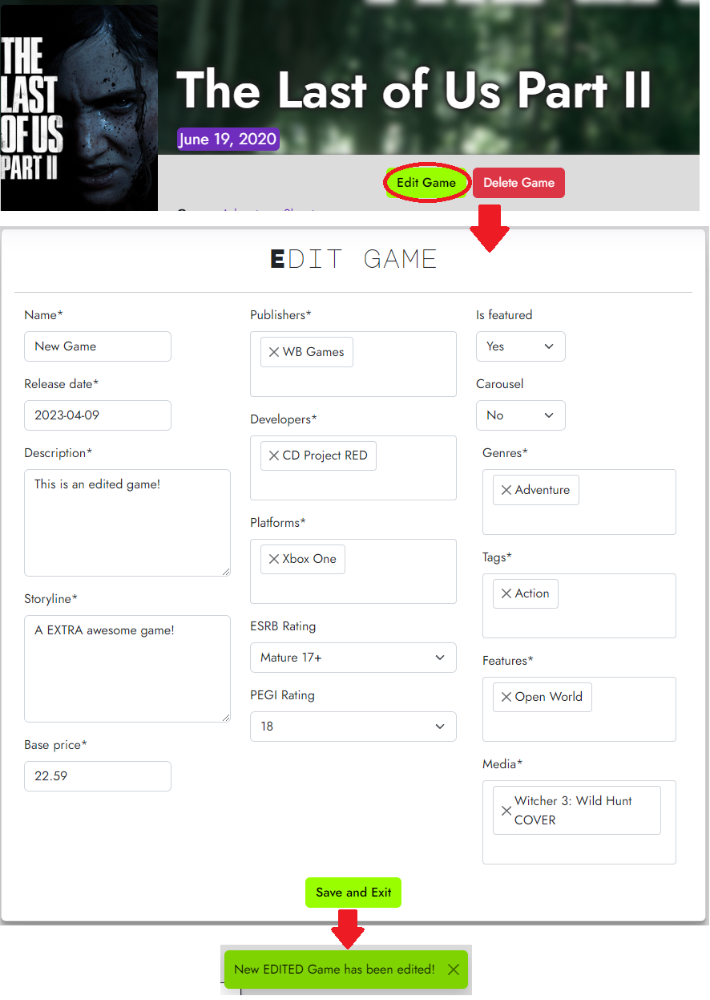

A20. As an admin/site owner, I want to be able to delete Game/DLC content through the main website.

| Feature | Action | Expected Result | Actual Result
|--- |--- |--- |---
| Game Details Page | Click on any game to open the Game Details page while logged in as staff/superuser, then click on the "Delete Game" button to trigger the delete modal. To delete the game or DLC, click "Delete Game" | Staff/Superuser is able to successfully delete a Game or DLC object from the database. | As expected.

 Supporting Images 

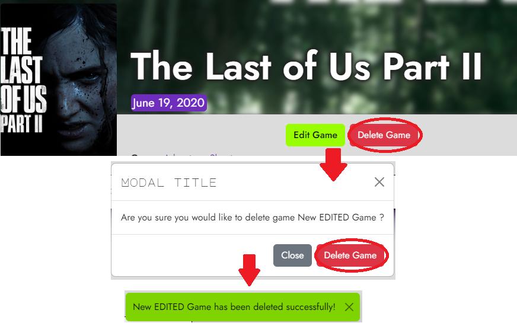

A21. As an admin/site owner, I want existing users to be able to rate the game/DLC products.
B11. As a potential/new user, I want to be able to see user ratings for the products.
C14. As a existing user, I want to be able to see user ratings for the products.
C15. As an existing user, I want to be able to leave a rating for a product.

| Feature | Action | Expected Result | Actual Result
|--- |--- |--- |---
| Game Details Page | While logged-in as a user, click on any game to open the Game Details page, then hover over the stars to see the available options, and once you've made your choice click on the corresponding star. | Logged-in users are able to successfully cast their vote for a game. | As expected.

 Supporting Images 

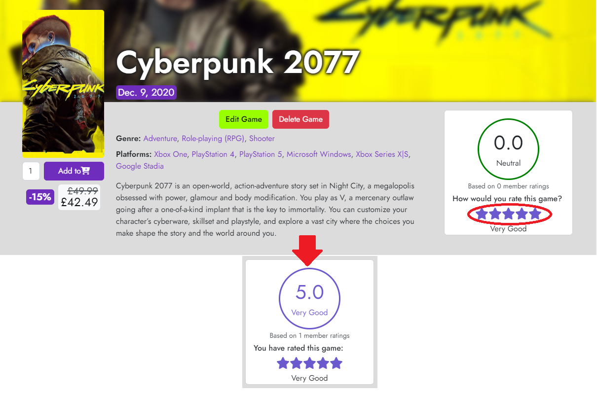

C6. As an existing user, I want to be able to add or remove additional e-mail addresses to my account.

| Feature | Action | Expected Result | Actual Result
|--- |--- |--- |---
| Profile | While logged in, from any page click on the 'My Profile' on the navigation bar, then on the Account Navigation menu, click "Manage Email Accounts". Once on the "Manage Email Accounts" page, enter an e-mail address in the input field then press Add to add the address to your account. To remove it, simply select the address you wish to remove and click the red "Remove" button. | User is able to successfully add or remove e-mail addresses to their account. | As expected.

 Supporting Images 

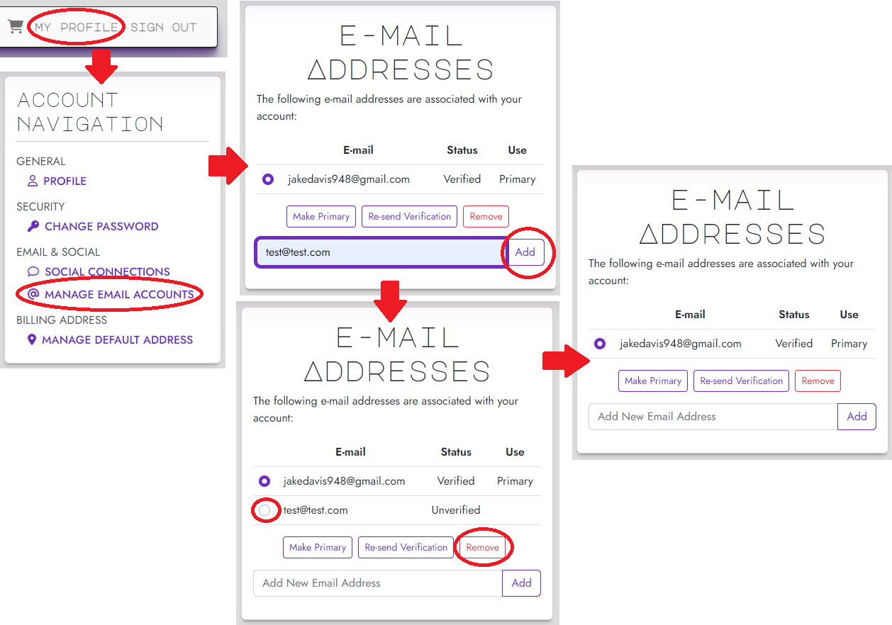

C8. As an existing user, I want the website to store my shopping cart and contents between logins.

| Feature | Action | Expected Result | Actual Result
|--- |--- |--- |---
| Cart | None | Whenever the user logs out with a full cart their cart is stored in the database until their next login. | As expected.

B8. As a potential/new user, I want to be able to sort products by different criteria (e.g. price, popularity, rating).
C13. As an existing user, I want to be able to sort products by different criteria (e.g. price, popularity, rating).

| Feature | Action | Expected Result | Actual Result
|--- |--- |--- |---
| Browse Page | Navigates to the Browse page using the navigation bar, then use the dropdown menu to select your preferred sorting setup. | User is able to successfull sort the displayed games by using the sort dropdown menu. | As expected.

 Supporting Images 

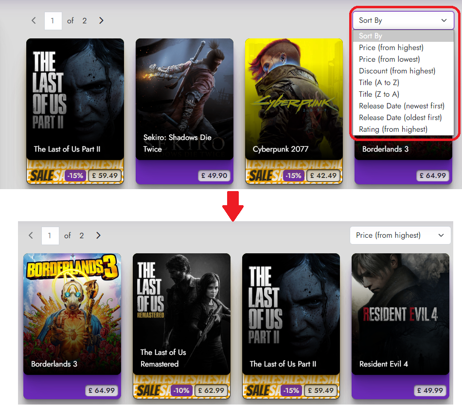

B13. As an potential/new user, I want to be able to view images and videos for a product.
C17. As an existing user, I want to be able to view images and videos for a product.

| Feature | Action | Expected Result | Actual Result
|--- |--- |--- |---
| Game Details Page | Navigates to the Browse page using the navigation bar, then click one of the game cards to open the Game Details page. From there, scroll down slightly to view the games media carousel. | User is able to successfully view images and videos for a specific product. | As expected.

 Supporting Images 

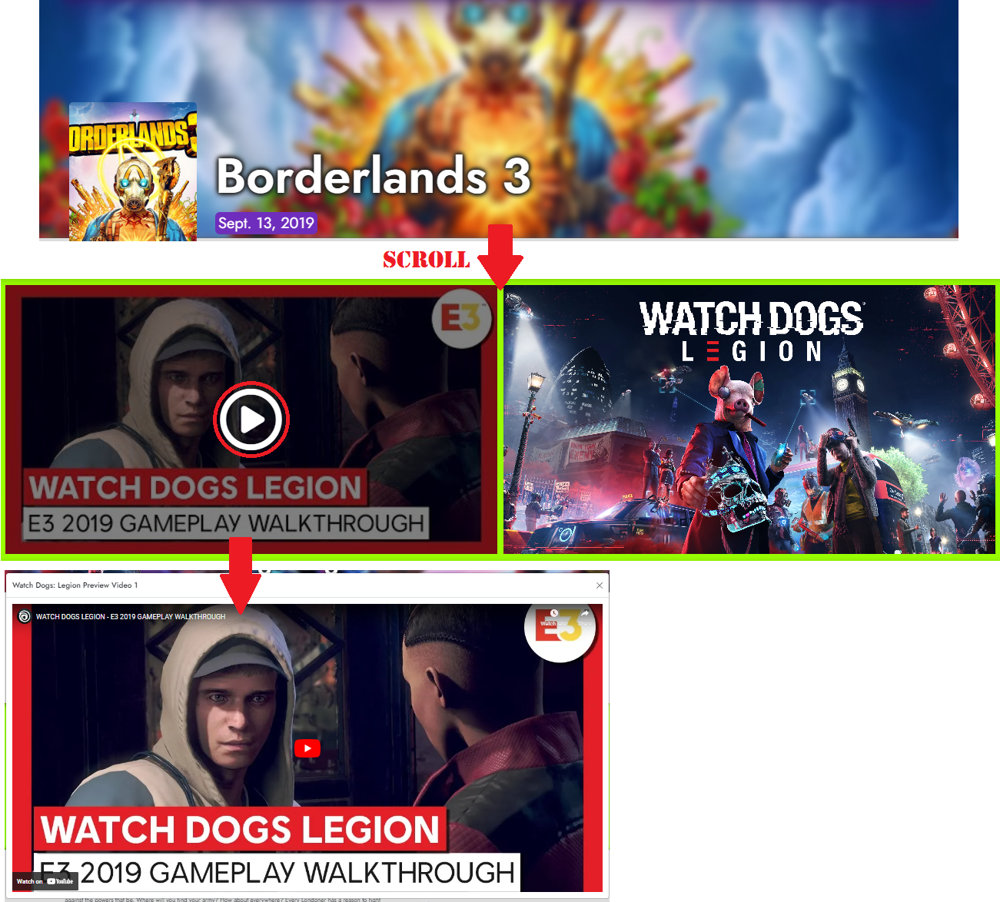

B10. As an potential/new user, I want to be able to browse and search for games that are associated with a specific publisher, developer, or platform, so that I can discover and access the games that interest me.
C19. As an existing user, I want to be able to browse and search for games that are associated with a specific publisher, developer, or platform, so that I can discover and access the games that interest me.

| Feature | Action | Expected Result | Actual Result
|--- |--- |--- |---
| Game Attribute Page | Click on any game to open the Game Details page. Once there, scroll to the bottom to locate the game information section, then click on any of the available links to open either the Browse page with pre-defined filter applied, or a dedicated page via which you can browse games. | User is able to visit and interact with both the Browse page with pre-defined filter applied and the dedicated page. | As expected.

 Supporting Images 

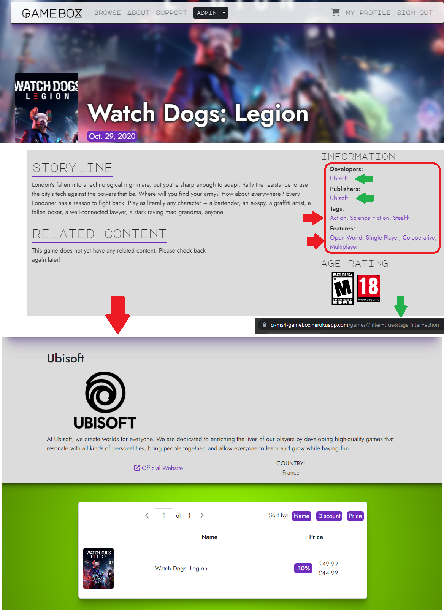

C12. As an existing user, I want to be able to sign up for the site's newsletter to receive notifications.

| Feature | Action | Expected Result | Actual Result
|--- |--- |--- |---
| Footer | From any page, scroll down to the bottom, then add your e-mail address to the input field and click "Subscribe". | User is able to find the form and subscribe to the newsletter. | As expected.

 Supporting Images 

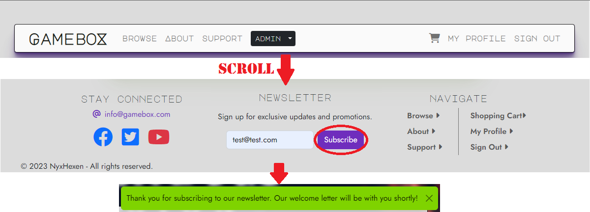

| Feature | Action | Expected Result | Actual Result
|--- |--- |--- |---
| Cart & Checkout | Add any games to your cart, then from any page, click on the shopping cart icon to navigate to the shopping cart page. Once you are happy with your order, click on Proceed to Checkout to move to the next stage. Once on the checkout page, enter your billing information, your card details, and click Pay Now. Depending on the payment's outcome, you will be redirect to a separate page which confirms your order, provides you with an order number, and sends an e-mail confirmation.| User is able to successfully purchase games through the cart and checkout pages and receives a confirmation email after their purchase. | As expected.

 Supporting Images 

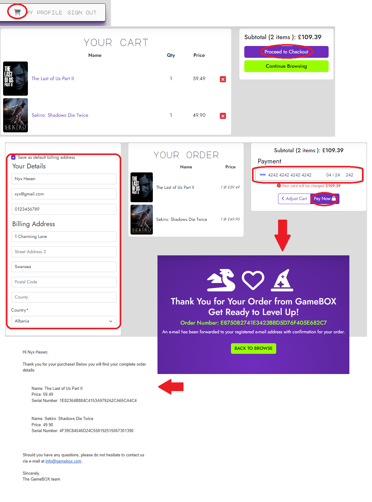

